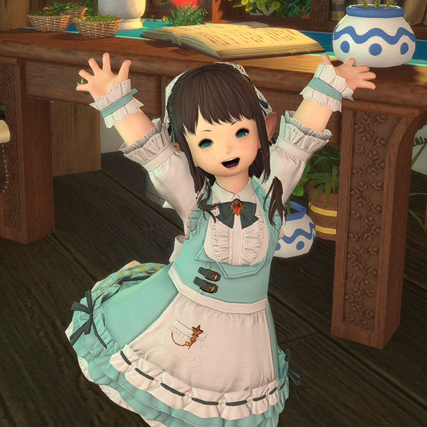

# Erina's biography

Hello!! I'm [Erina Yukine](https://eu.finalfantasyxiv.com/lodestone/character/49272662/)!

&nbsp;

I was born in **Kugane** from a wealthy family of merchants with business partnerships all around the world. I learned many dealing trickeries from them and I myself really enjoy partaking in the art of making the market.

&nbsp;

Around the time I was 8 summers old my family decided to move to **Ul'dah** in **Thanalan** to seek new business opportunities. That's where I first met the Sultana, **Nanamo Ul'Namo**. When I heard the news that she spared the life of a good warrior that was unjustly condemned she immediately became my role model. A flame sparked in me and I decided that I too would have protected the people I cared about. And so I started learning about magic, the aether and how it could be used to assist the ones in need for help.

&nbsp;

Six years later, when I had an opportunity to travel alone, I went to **Gridania** and made it my home, with the intent to study with the best **conjurers** to become a **white mage** that could heal any type of illness and wounds! That's when I first heard the call of **Hydaelyn** and my adventure in **Eorzea** officially began.

&nbsp;

I like to craft my wares, sell them, cultivate plants, also sell them, and finally bring my magic everywhere I go. I also really like **cute dresses** with a ton of frills, and I often end up spending months worth of earnings on them. They truly are my worst weakness...

&nbsp;

Thank you for taking the time to read about me. I hope we'll go along well in the world of **Final Fantasy XIV**!
