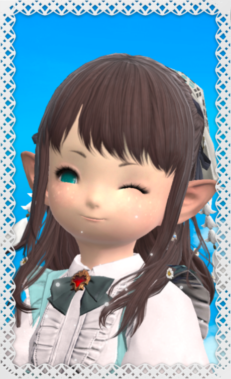

# Erina's biography

Hi! I'm [Erina Yukine](https://eu.finalfantasyxiv.com/lodestone/character/49272662/)!

&nbsp;

I was born in Kugane from a wealthy family of merchants. My family had a lot of business partnerships with the people of Doma and I learned many of my dealing trickeries from the merchants around me.

&nbsp;

Around the time I was 8 summers old my family decided to move to Ul'dah in Thanalan to seek new business opportunities. That's where i first met the sultana, Nanamo Ul'Namo. When I heard the news that she spared the life of a good warrior that was unjustly condemned in Ul'dah's arena, that sparked a flame in me and I decided that I would have too protected the people I cared about. And so I started learning about magic, aether and how it could be used to help in battle.

&nbsp;

Six years later, when I had an opportunity to travel alone, I went to Gridania and made it my home, with the intent to study with the best white magicians to become myself a white mage that could heal any type of illness and wounds! That's when I first heard the call of Hydaelyn and my adventure in Eorzea officially began.

&nbsp;

In Eorzea I like to craft my wares, sell them, cultivate plants, also sell them, and finally bring my magic everywhere I go. I also really like cute dresses, and I often end up spending a month worth of earnings on them.

&nbsp;

Nice to meet you! I hope we'll go along well!
