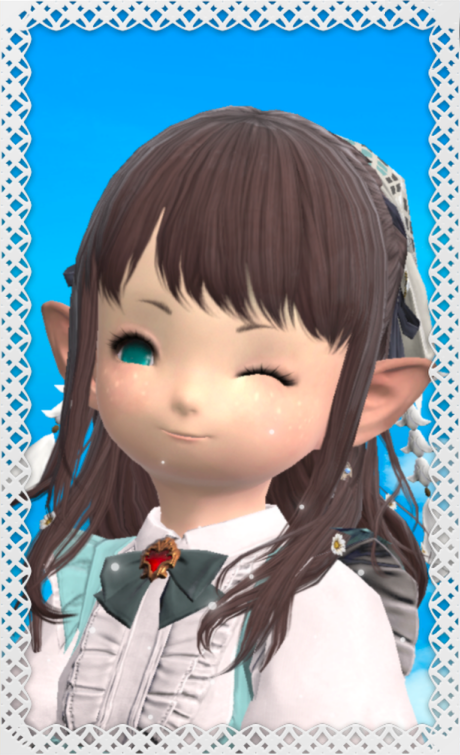
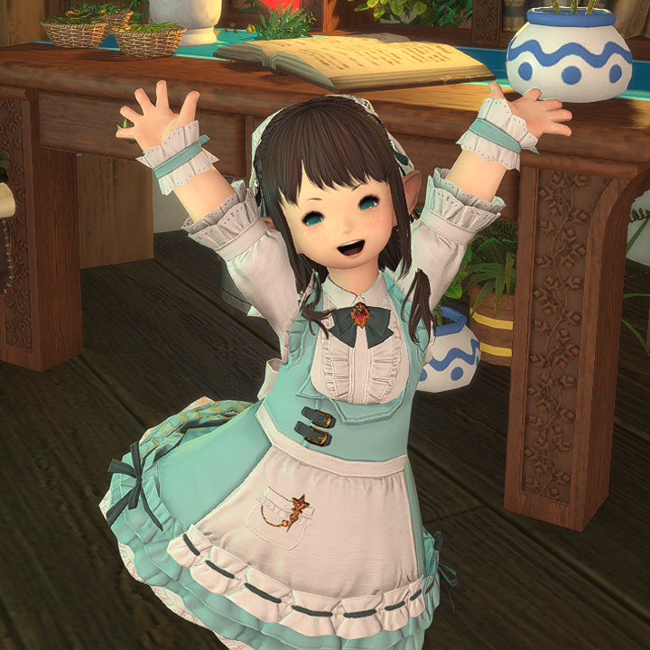

# Erina's biography

Hello!! I'm Erina!

&nbsp;

I was born in [Kugane](https://finalfantasy.fandom.com/wiki/Kugane) from a wealthy family of merchants with business partnerships all around the world. I learned many dealing trickeries from them and I myself really enjoy partaking in the art of making the market.

&nbsp;

Around the time I was 8 summers old my family decided to move to [Ul'dah](https://finalfantasy.fandom.com/wiki/Ul'dah) in [Thanalan](https://finalfantasy.fandom.com/wiki/Thanalan) to seek new business opportunities. That's where I first met the Sultana, **Nanamo Ul'Namo**. When I heard the news that she spared the life of a good warrior that was unjustly condemned, she immediately became my role model. A flame sparked in me and I decided that I too would have protected the people I cared about. And so I started learning about magic, the aether and how it could be used to assist the ones in need for help.

&nbsp;

Six years later, when I had an opportunity to travel alone, I went to [Gridania](https://finalfantasy.fandom.com/wiki/Gridania) and made it my home, with the intent to study with the best [conjurers](https://ffxiv.consolegameswiki.com/wiki/Conjurer) to become a [white mage](https://ffxiv.consolegameswiki.com/wiki/White_mage) that could heal any type of illness and wounds! That's when I first heard the call of **Hydaelyn** and my adventure in [Eorzea](https://finalfantasy.fandom.com/wiki/Eorzea) officially began.

&nbsp;

I like to craft my wares, sell them, cultivate plants, also sell them, and finally bring my magic everywhere I go. I also really like **cute dresses** with a ton of frills, and I often end up spending months worth of earnings on them. They truly are my worst weakness...

&nbsp;

Thank you for taking the time to read about me. I hope we'll go along well in the world of **Final Fantasy XIV**!
|||||
# About Erina
**Name:** [Erina Yukine](https://eu.finalfantasyxiv.com/lodestone/character/49272662/)

&nbsp;

**Age:** 15 summers

&nbsp;

**Nameday:** 11th Sun of the 5th Umbral Moon

&nbsp;

**Likes:** Cute things, frills

&nbsp;

**Dislikes:** Gross men, mature stuff

&nbsp;

**Guardian:** [Menphina, the Lover](https://finalfantasy.fandom.com/wiki/Menphina)

&nbsp;

**Alignment:** Chaotic good

&nbsp;

**Homeland:** [Kugane](https://finalfantasy.fandom.com/wiki/Kugane), [Hingashi](https://finalfantasy.fandom.com/wiki/Hingashi)

&nbsp;

**Lives in:** [Gridania](https://finalfantasy.fandom.com/wiki/Gridania), [The Black Shroud](https://finalfantasy.fandom.com/wiki/Black_Shroud)

&nbsp;

**Afraid of:** Not being enough, [Doom](https://ffxiv.consolegameswiki.com/wiki/Doom)

&nbsp;

**Not afraid of:** [Calcabrina](https://finalfantasy.fandom.com/wiki/Calco_and_Brina)

&nbsp;

**Favorite food:** [Smoked Chicken](https://eu.finalfantasyxiv.com/lodestone/playguide/db/item/ee851a0fcfc/), [Pizza](https://eu.finalfantasyxiv.com/lodestone/playguide/db/item/bc2468db942)

&nbsp;

**Favorite beverage:** [Pixieberry Tea](https://eu.finalfantasyxiv.com/lodestone/playguide/db/item/8dac162a78d/)

&nbsp;

**Hobbies:** Making and selling crafts, gathering plants, gardening

&nbsp;

**Best friends:** [Khloe](https://finalfantasy.fandom.com/wiki/Khloe_Aliapoh) & [Zhloe Aliapoh](https://finalfantasy.fandom.com/wiki/Zhloe_Aliapoh)
