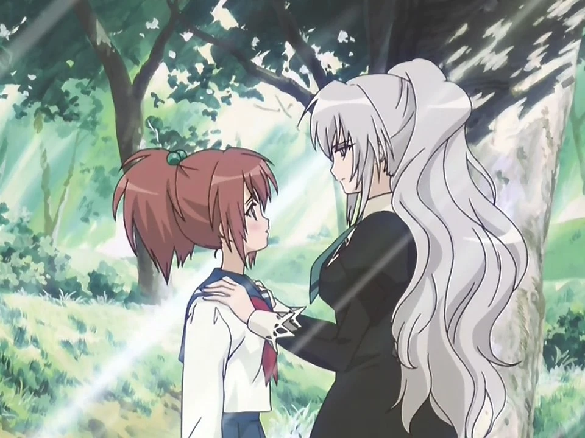
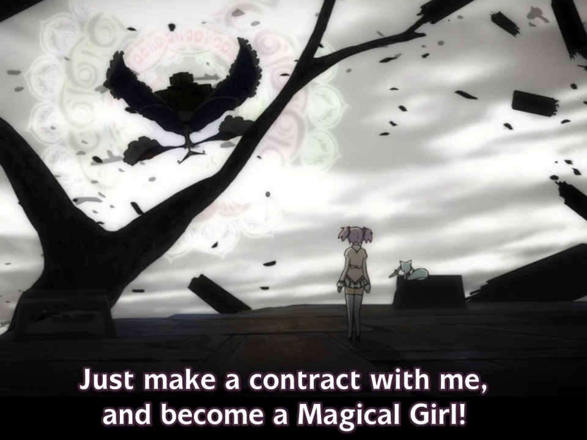
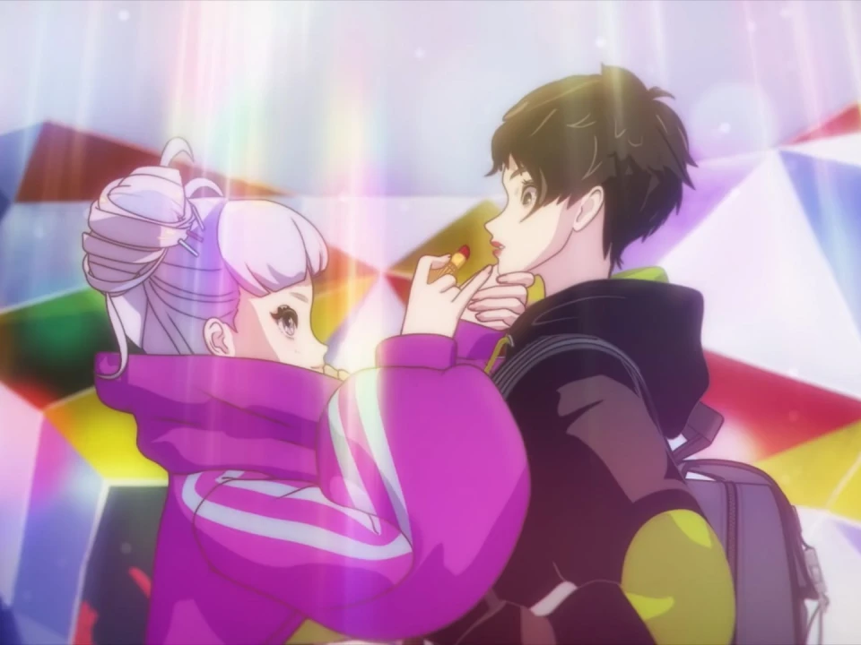
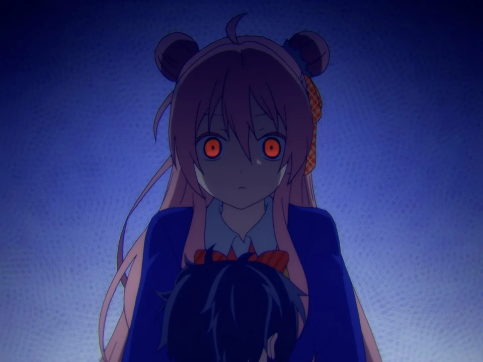
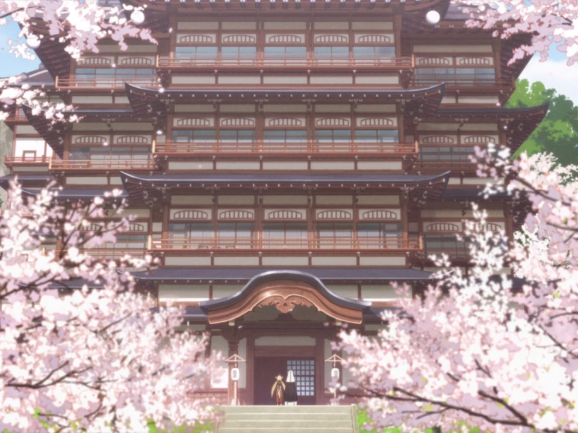

# Anime that I really like
Anime are the best form of TV content and I really think they should replace those boring TV shows with real people doing real stuff. These are some of my favorite anime:

&nbsp;

### [Strawberry Panic](https://myanimelist.net/anime/855/Strawberry_Panic)

I don't think this one comes as a surprise. This is my absolute favorite anime. I love it. I love the emotions it makes me feel, I love the Étoile, I love Astraea Hill, I love watching it tens of times on repeat. I love everything about this anime. I love it so much that I even made an Italian translation that [you can find here](https://t.me/EricchiFansub/106).  

### [Mahou Shoujo Madoka★Magica](https://myanimelist.net/anime/9756/Mahou_Shoujo_Madoka★Magica)
I adore magical girls, in particular when the majokko anime genre gets totally subverted, like in this case where there's something that's just not right in the process of being able to become one. Certain delicate issues are dealt with perfectly and both the graphic style and the music are just sublime.  

### [Artiswitch](https://myanimelist.net/anime/49066/Artiswitch)
An unexpected surprise of a short anime that really took my heart. Each one of its 6 episodes is just 8 minutes long, but those minutes are used perfectly. The anime is about a witch that lures lost artists in her shop and tries to make them understand what to do to make them find their way in life.  

### [Chobits](https://myanimelist.net/anime/59/Chobits)
An alternative universe where computers are not boxes on desks but humanoids accompanying humans in their everyday lives. The anime focuses on a special computer named Chii and her new owner that doesn't understand anything about computers. It also explores romantic themes from a really unusual point of view.  

### [Happy Sugar Life](https://myanimelist.net/anime/37517/Happy_Sugar_Life)
Ań̴̪ absolutely norm̴̲͐al anime that tells the sto̵̠̒ry of a really norma̴l girl and her not spec̵̡͛ial at all roomm̶̳̈́ate. They jus̴̝͆t̸̛͎ l̶̨̈́i̸̞̓ve their happy sugar liv̷̠͊e̵̱̔s̷̨̔ tog̸e̴t̶her an̶d th̸e̵r̵e̶'s a̷b̴s̷olutel̷y̶ n̴o̴t̶hing wro̴n̷g̴ wi̸t̵h th̸e̵m̶. For r̶e̵a̸l, bel̸i̵e̸v̴e̷ me̷.̶.̶.̵    

### [Konohana Kitan](https://myanimelist.net/anime/35241/Konohana_Kitan)
Before reaching the afterlife, the souls of the departed need to undertake a very long journey to reach their destination. If they feel tired along the way, there's an inn halfway through that's always ready for them and can offer some relief. The anime is about the workers of this very inn, and also about their customers who often have really touching stories to tell.
